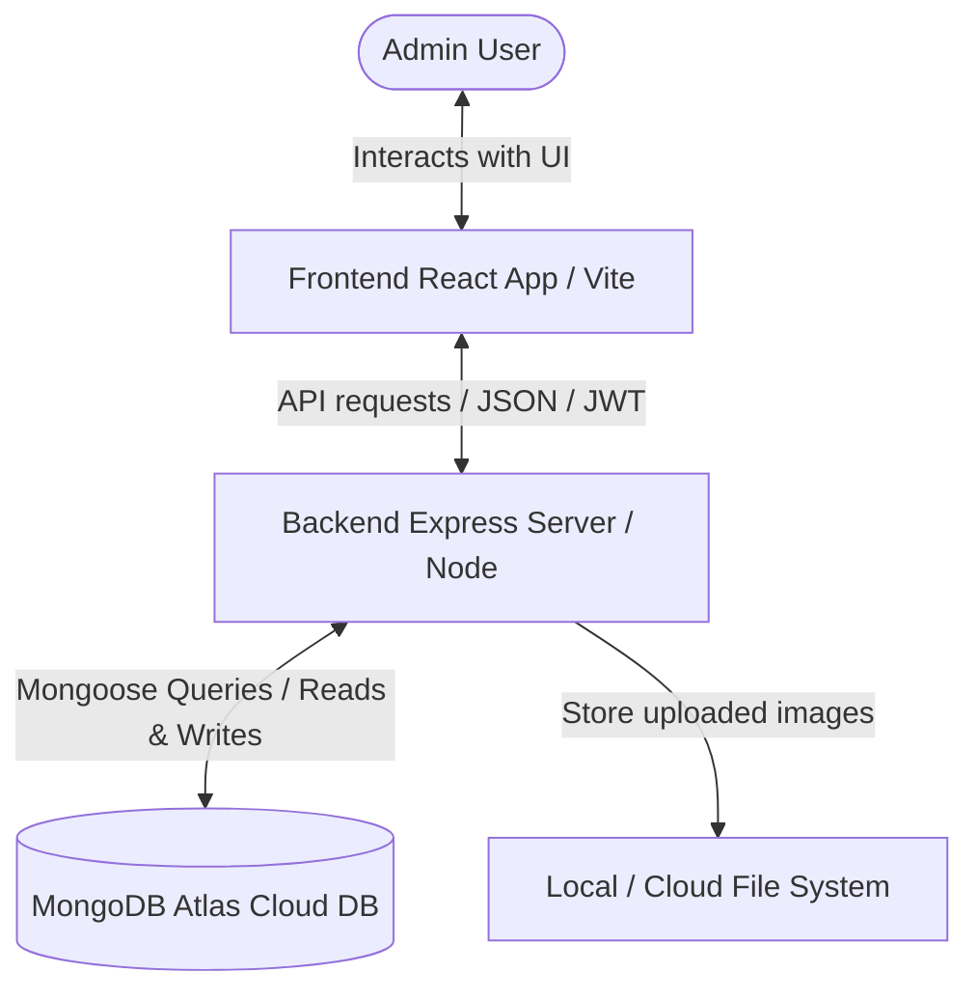
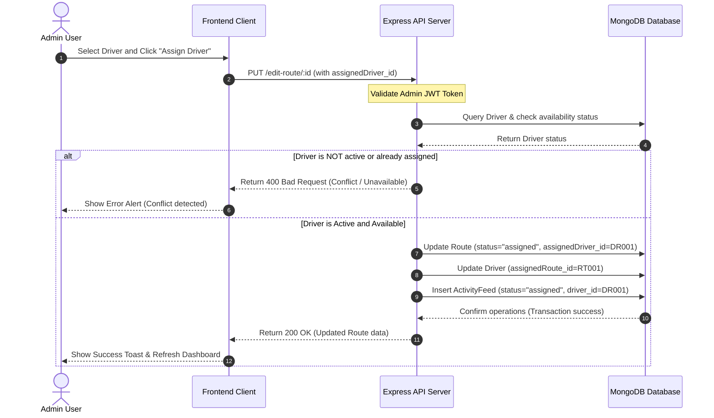
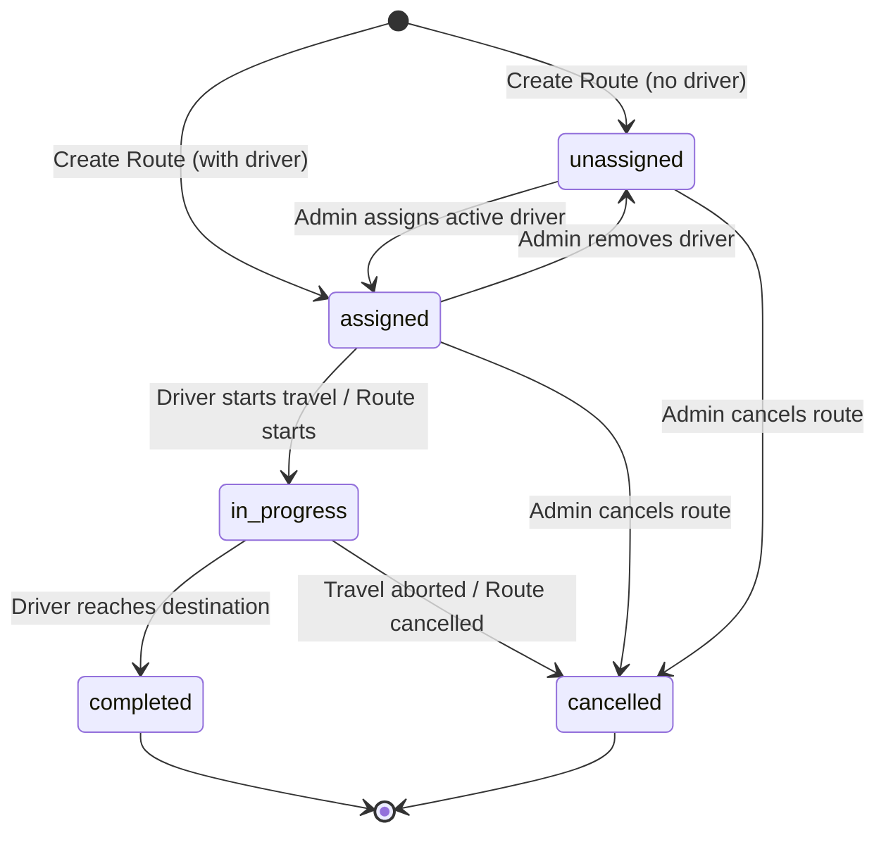
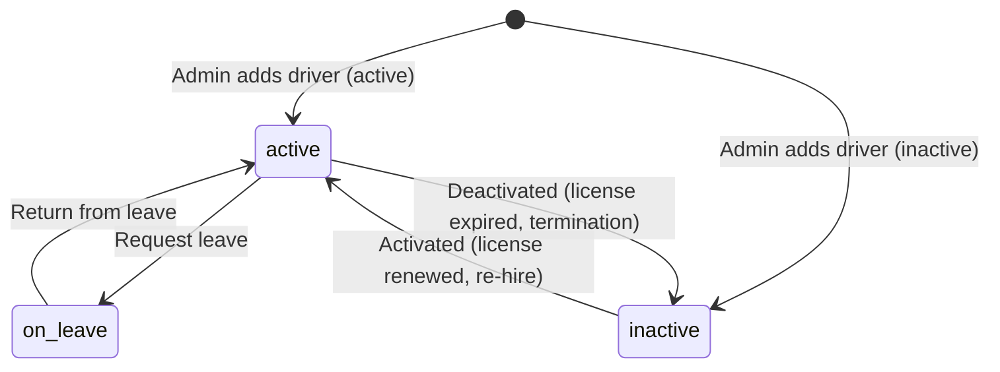

# System Operations & User Flows

This document details the system architecture, operational steps, user flows, and state transitions of the **DRB Driver Scheduling System**.

---

## 🏛️ System Architecture Diagram

---

## 🔄 Sequence Diagram: Driver Assignment Flow

This diagram describes the sequence of actions when an administrator assigns an active driver to a route.

---

## 🚦 State Machine Diagrams

### 1. Route Status Lifecycle

Routes transition between statuses based on scheduling phases:

### 2. Driver Status Lifecycle

Drivers can be updated or scheduled, modifying their operational status:

---

## 📋 Core System Operations & Validations

The scheduling engine enforces structural business logic before carrying out database writes:

### 1. Driver Assignment Validation
Before writing an `assignedDriver_id` to a Route, the backend checks:
- Is the driver's status `active`? (On leave or inactive drivers cannot be assigned).
- Does the driver have a current `assignedRoute_id`? (A driver cannot be assigned to two routes simultaneously).
- Does the driver have valid license expiration dates?

### 2. Status Synchronization
To prevent stale states, updating a route automatically cascades to the associated driver:
*   When a Route becomes **In Progress**:
    - The Route status changes to `"in progress"`.
    - The Driver's current route remains `"assignedRoute_id"`, but their status indicates active travel.
*   When a Route is **Completed**:
    - The Route status changes to `"completed"`.
    - The Route moves `assignedDriver_id` to `lastDriver_id` and sets `assignedDriver_id = null`.
    - The Driver's `assignedRoute_id` is set to `null` (making them available).
    - The completed route's summary (ID, locations, dates) is pushed to the driver's `pastAssignedRoutes` array.

---

## 🚶 User Journeys & App Flows

### 1. Add Route & Assign Driver Flow
1. Admin navigates to the **Routes** page.
2. Clicks the **Add Route** button (opening the modal).
3. Fills in starting point, destination, distance, duration, and estimated cost.
4. (Optional) Selects an available driver from the dropdown. The dropdown dynamically filters out drivers who are "on leave", "inactive", or already assigned to another route.
5. Clicks **Submit**. The frontend validates forms and posts to `/add-new-route`.
6. Successful submission shows a toast, updates dashboard analytics, and logs an assignment activity.

### 2. Driver Profile Setup & Document Upload
1. Admin navigates to the **Drivers** page.
2. Clicks **Add Driver**.
3. Uploads the driver's profile image and a scanned copy of their driving license (validated for JPEG/PNG and size < 5MB).
4. Enters phone, address, and license detail parameters.
5. Frontend uploads files first via `/upload-image-on-server` which returns storage paths.
6. The frontend then posts the complete profile object with the returned image URLs to `/add-new-driver`.
7. Profile page renders the upload documents, tracking license expiration alerts.
